# Chainlink Price Feeds

## Chainlink Price Feed Contracts

Start with reading [using price feeds](https://docs.chain.link/docs/data-feeds/price-feeds/).

Check out the [feed contracts](https://docs.chain.link/docs/data-feeds/price-feeds/addresses/?network=ethereum)

Play around with the USDC/USD feed contract in the [etherscan interface](https://etherscan.io/address/0x8fFfFfd4AfB6115b954Bd326cbe7B4BA576818f6#readContract)

* `description` shows the feed description (eg 'USDC / USD')
* `decimals` returns the number of decimals to use (eg 8)
* `latestRoundData` returns the most recent price feed data
* `phaseId` returns the id of the currently active aggregator 
* `phaseAggregators` returns the aggregator contract address for the provided phase id

Using `phaseAggregators(1)` returns the first aggregator contract. 
Play around with the first USDC/USD [aggregator contract](https://etherscan.io/address/0x3B15a92872435C01c27201AAe0968839fB45217D#readContract)

* `getRoundData` returns the price feed data for the specified round 1 ... `latestRound`
* `latestRound` returns the last round id for this feed contract that provided price feed data.

## Dealing with Historical Price Feed Data

Working with the Chainlink price feed data is straight forwards as long as there is only a single active aggregator contract.

When more than a single aggregator contract is producing data for a given time frame the situation is less clear.

Attempt to clarify this point on [Stackexchange](https://ethereum.stackexchange.com/questions/114835/read-all-historical-price-data-of-a-chainlink-price-feed-in-javascript/138131#138131)

## Data Extraction Pipeline

Extract raw data using chainlink price feed contract for USDC/USD on ethereum mainnet.

Extracting extensive amounts of data using a public RPC endpoint usually leads to running into limits rather soon.
One option to deal with this is to work with Infura endpoints.
Such an endpoint may be provided via in the `RPC_MAINNET` variable in the `.env` file.

The implemented mechanism runs though all available aggregator contracts for a feed contract starting with the oldest aggregator (phaseId = 1) and fetching all price values using `getRoundData` for values 1 ... `latestRound`.
The phaseId is increased by one and the procedure is repeatet to get more data until all data of the current aggregator has been fetched.
### USDC Step by Step

```bash
python scripts/price_feed.py --net mainnet --pair USDC/USD > chainlink_usdc_usd_all.txt
```

Convert price feed raw data into CSV format

```bash
cat chainlink_usdc_usd_all.txt | python scripts/feed2csv.py > chainlink_usdc_usd_all.csv
```

Compact CSV price feed file (remove duplicates from different phase IDs).

Currently, price data is sorted by propoerty `updatedAt` from the Chainlink price feed.

```bash
python scripts/compact_feed.py chainlink_usdc_usd_all.csv chainlink_usdc_usd.csv
```

Plot CSV file (answer against updatedAt)

```bash
python scripts/plot_feed.py chainlink_usdc_usd.csv chainlink_usdc_usd.png --title "USDC/USD"
```

Resulting plot

 
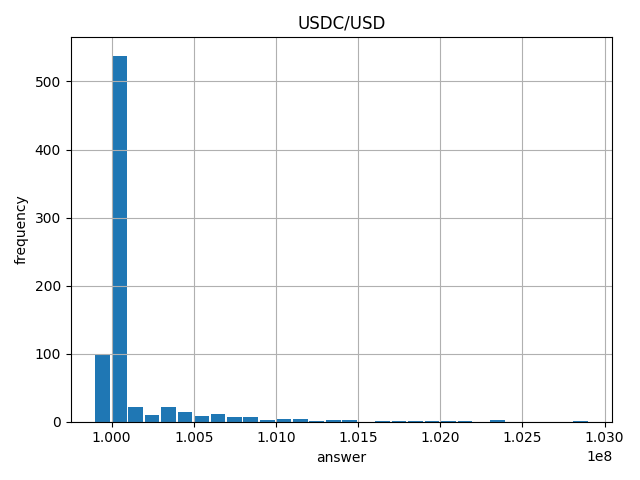


### USDT Condensed

```bash
python scripts/price_feed.py --net mainnet --pair USDT/USD > chainlink_usdt_usd_all.txt
cat chainlink_usdt_usd_all.txt | python scripts/feed2csv.py > chainlink_usdt_usd_all.csv
python scripts/compact_feed.py chainlink_usdt_usd_all.csv chainlink_usdt_usd.csv
python scripts/plot_feed.py chainlink_usdt_usd.csv chainlink_usdt_usd.png --title "USDT/USD"
```

Resulting plot


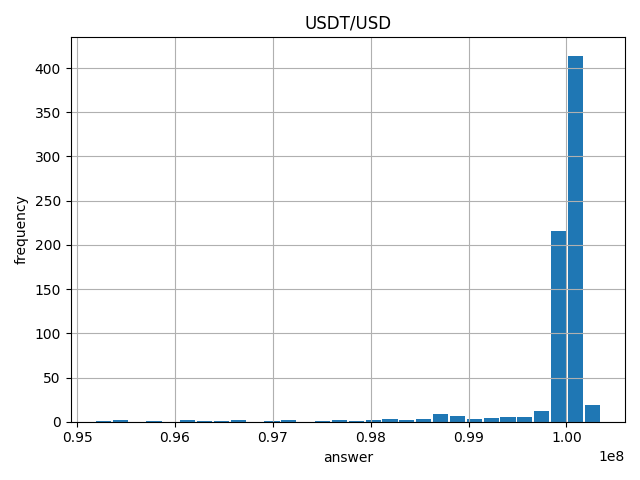

### Neutrino USDN Condensed

```bash
python scripts/price_feed.py --net mainnet --pair USDN/USD > chainlink_usdn_usd_all.txt
cat chainlink_usdn_usd_all.txt | python scripts/feed2csv.py > chainlink_usdn_usd_all.csv
python scripts/compact_feed.py chainlink_usdn_usd_all.csv chainlink_usdn_usd.csv
python scripts/plot_feed.py chainlink_usdn_usd.csv chainlink_usdn_usd.png --title "USDN/USD"
```

Resulting plot

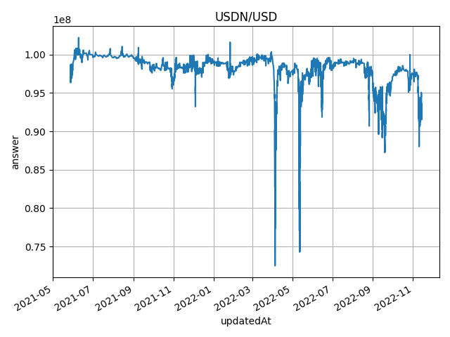
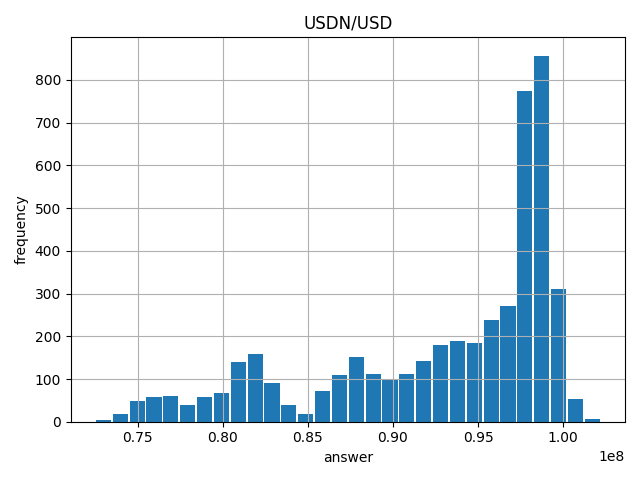

### Unity USDP Condensed

```bash
python scripts/price_feed.py --net mainnet --pair USDP/USD > chainlink_usdp_usd_all.txt
cat chainlink_usdp_usd_all.txt | python scripts/feed2csv.py > chainlink_usdp_usd_all.csv
python scripts/compact_feed.py chainlink_usdn_usd_all.csv chainlink_usdn_usd.csv
python scripts/plot_feed.py chainlink_usdn_usd.csv chainlink_usdn_usd.png --title "USDN/USD"
python scripts/histogram_feed.py chainlink_usdp_usd.csv chainlink_usdp_usd_hist.png --title "USDP/USD"
```

Resulting plot

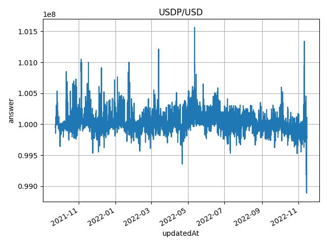
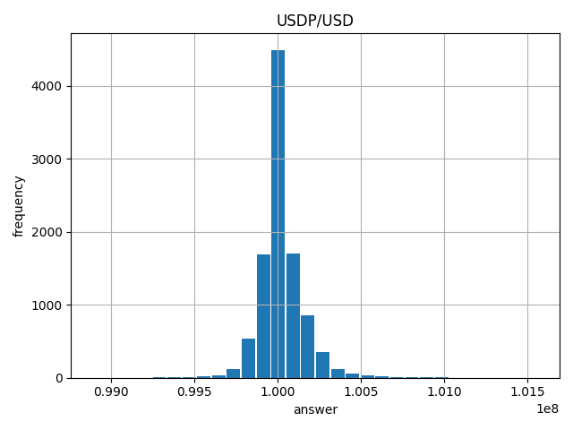

### True TUSD Condensed

```bash
python scripts/price_feed.py --net mainnet --pair TUSD/USD > chainlink_tusd_usd_all.txt
cat chainlink_tusd_usd_all.txt | python scripts/feed2csv.py > chainlink_tusd_usd_all.csv
python scripts/compact_feed.py chainlink_tusd_usd_all.csv chainlink_tusd_usd.csv
python scripts/plot_feed.py chainlink_tusd_usd.csv chainlink_tusd_usd.png --title "TUSD/USD"
python scripts/histogram_feed.py chainlink_tusd_usd.csv chainlink_tusd_usd_hist.png --title "TUSD/USD"
```

Resulting plot

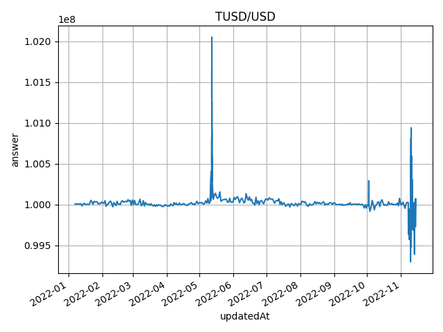
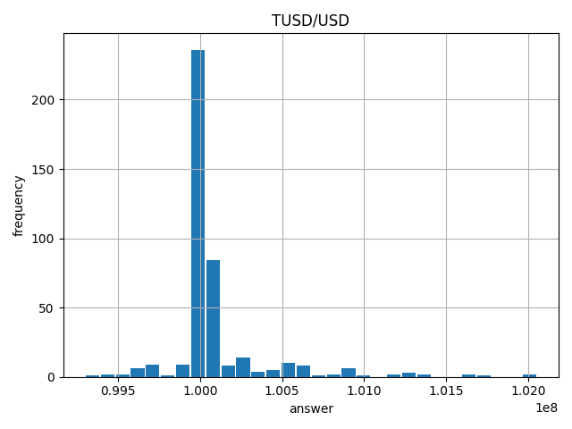

## Depeg Trigger (and Recovery)
### USDC Depeg Analysis

```bash
python scripts/analyze_feed.py chainlink_usdc_usd.csv --triggerValue 0.995 --recoverValue 0.999 --maxDuration 1 --plotMinValue 0.97 --title "USDC/USD" --pngFile chainlink_usdc_depeg.png
```

Script output

```bash
triggerValue: 0.995 (99500000)
recoverValue: 0.999 (99900000)
```

Plot

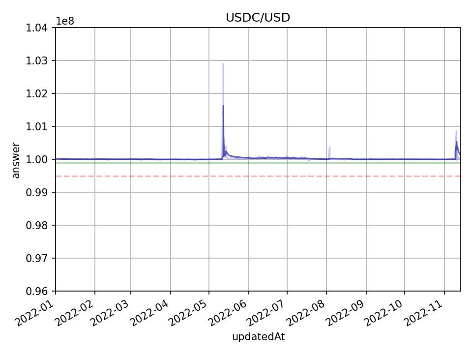

### USDT Depeg Analysis

```bash
python scripts/analyze_feed.py chainlink_usdt_usd.csv --triggerValue 0.99 --recoverValue 0.995 --maxDuration 1 --plotMinValue 0.9 --title "USDT/USD" --pngFile chainlink_usdt_depeg.png
```

Script output

```bash
triggerValue: 0.99 (99000000)
recoverValue: 0.995 (99500000)
TRIGGER roundId 36893488147419103690 answer 98750000 trigger 99000000 dateTimeAt 2022-05-12 06:23:41
RECOVER ------- 0d 9:19:36 ticks 41 roundId 36893488147419103731 answer 99753476 dateTimeAt 2022-05-12 15:43:17
```

Plot


Zooming in

```bash
python scripts/analyze_feed.py chainlink_usdt_usd.csv --triggerValue 0.99 --recoverValue 0.995 --maxDuration 1 --plotMinValue 0.9 --title "USDT/USD" --pngFile chainlink_usdt_depeg_zoomed.png --plotDateMin 2022-05-10 --plotDateMax 2022-05-15
```

Zoomed Plot
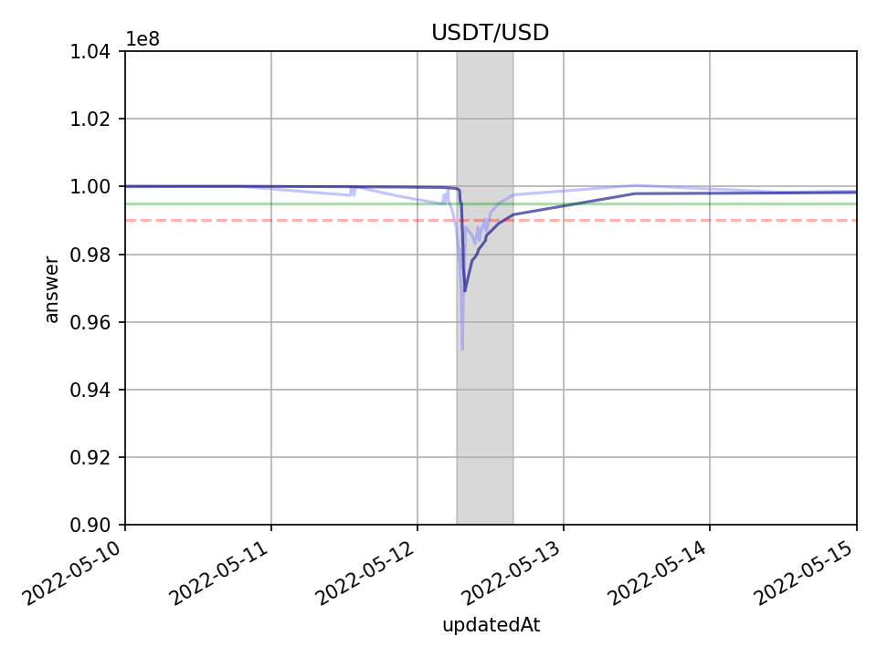

### USDN Depeg Analysis

```bash
python scripts/analyze_feed.py chainlink_usdn_usd.csv --triggerValue 0.97 --recoverValue 0.985 --maxDuration 2 --plotMinValue 0.85 --title "USDN/USD" --pngFile chainlink_usdn_depeg.png
```

Script output

```bash
...
TRIGGER roundId 18446744073709552311 answer 96900000 trigger 97000000 dateTimeAt 2022-01-24 08:05:45
RECOVER ------- 1d 11:0:42 ticks 25 roundId 18446744073709552336 answer 98622300 dateTimeAt 2022-01-25 19:06:27
TRIGGER roundId 18446744073709552534 answer 96992500 trigger 97000000 dateTimeAt 2022-04-03 00:00:20
RECOVER ------- 11d 1:34:9 ticks 321 roundId 18446744073709552855 answer 98613144 dateTimeAt 2022-04-14 01:34:29
TRIGGER roundId 18446744073709552879 answer 96798900 trigger 97000000 dateTimeAt 2022-04-24 11:16:04
RECOVER ------- 10d 12:33:33 ticks 25 roundId 18446744073709552904 answer 98858013 dateTimeAt 2022-05-04 23:49:37
TRIGGER roundId 18446744073709552917 answer 96750659 trigger 97000000 dateTimeAt 2022-05-10 00:09:57
RECOVER ------- 20d 6:34:13 ticks 1592 roundId 18446744073709554509 answer 98603667 dateTimeAt 2022-05-30 06:44:10
...
```

Plot
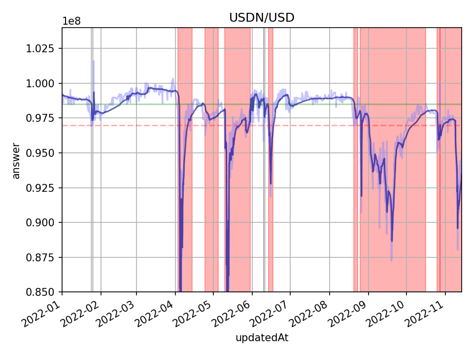

Zooming in 

```
python scripts/analyze_feed.py chainlink_usdn_usd.csv --triggerValue 0.97 --recoverValue 0.985 --maxDuration 2 --plotMinValue 0.7 --title "USDN/USD" --pngFile chainlink_usdn_depeg_zoomed.png --plotDateMin 2022-03-30 --plotDateMax 2022-04-15
```

Zoomed Plot
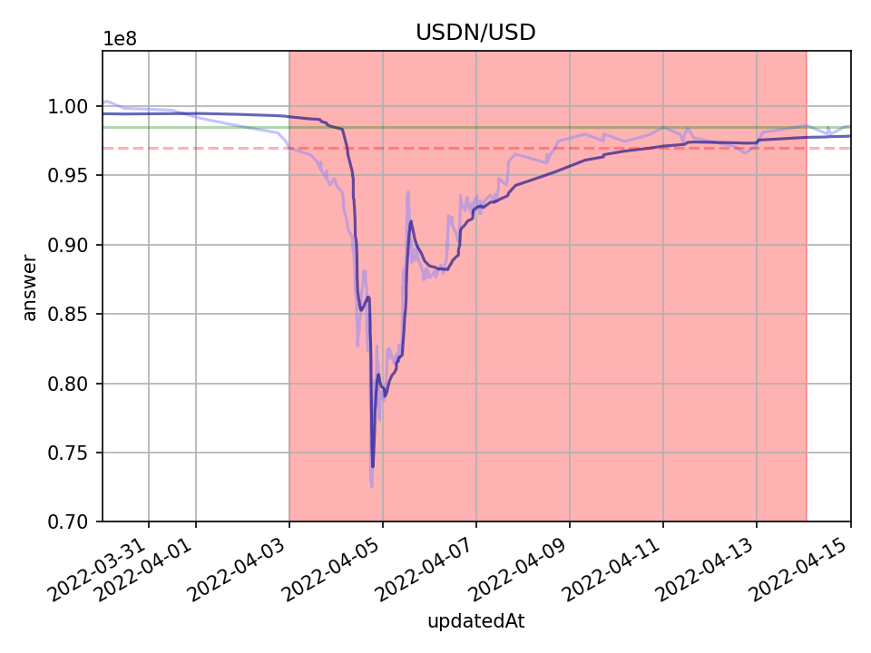


### USDP Depeg Analysis

```bash
python scripts/analyze_feed.py chainlink_usdp_usd.csv --triggerValue 0.995 --recoverValue 0.999 --maxDuration 2 --plotMinValue 0.85 --title "USDP/USD" --pngFile chainlink_usdp_depeg.png
```

Script output

```bash
triggerValue: 0.995 (99500000)
recoverValue: 0.999 (99900000)
TRIGGER roundId 18446744073709556709 answer 99491599 trigger 99500000 dateTimeAt 2022-04-21 16:06:37
RECOVER ------- 0d 6:1:51 ticks 6 roundId 18446744073709556715 answer 100002098 dateTimeAt 2022-04-21 22:08:28
```

Plot
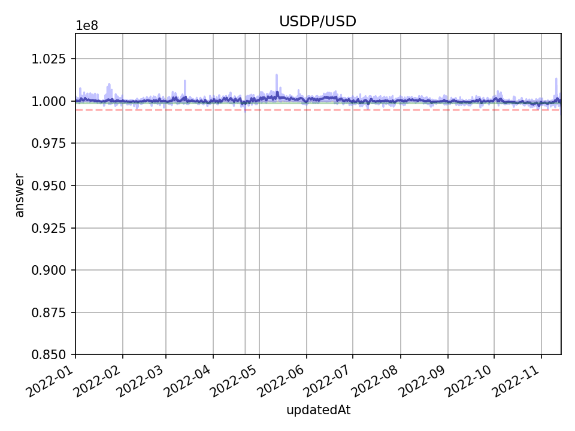

Chainlink price feed does not show any depeg tencency.
However, depending on individual data source this might look somewhat different:

* [USDP on coingecko (depeg on Oct 5th?)](https://www.coingecko.com/en/coins/usdp)
* [USDP on coinmarketcap (gaps, Apr-Jun, no depeg)](https://coinmarketcap.com/currencies/usdp/)

### TUSD Depeg

```bash
python scripts/analyze_feed.py chainlink_tusd_usd.csv --triggerValue 0.995 --recoverValue 0.999 --maxDuration 2 --plotMinValue 0.85 --title "TUSD/USD" --pngFile chainlink_tusd_depeg.png
```

Script output

```bash
triggerValue: 0.995 (99500000)
recoverValue: 0.999 (99900000)
```

Plot
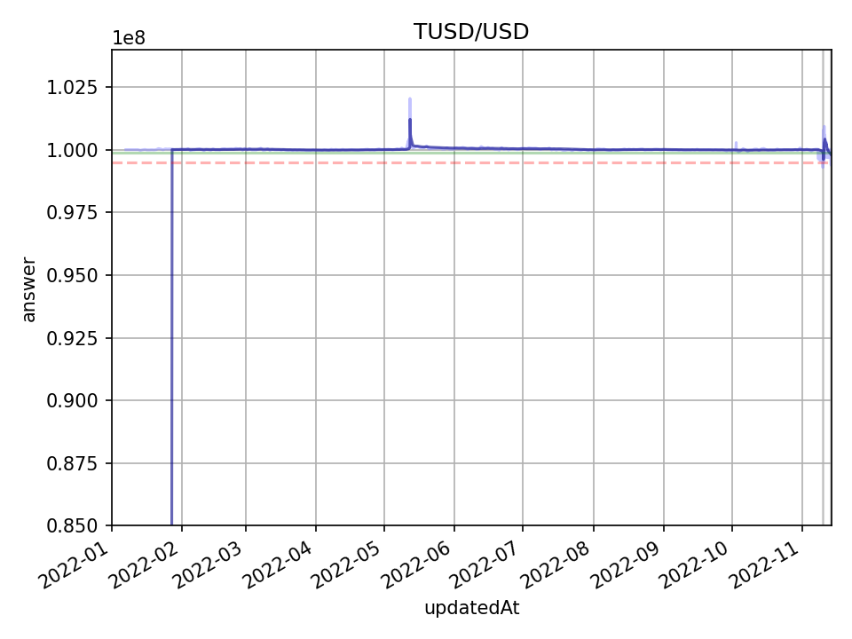
