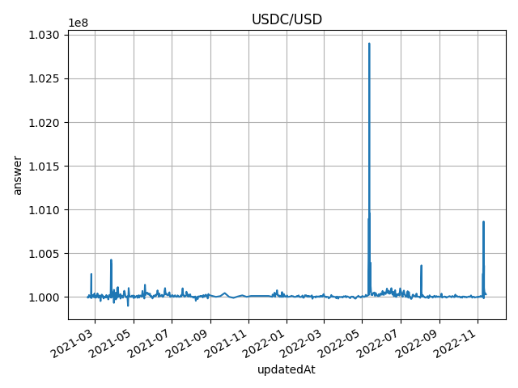

# Chainlink Price Feeds

## Chainlink Price Feed Contracts

Start with reading [using price feeds](https://docs.chain.link/docs/data-feeds/price-feeds/).

Check out the [feed contracts](https://docs.chain.link/docs/data-feeds/price-feeds/addresses/?network=ethereum)

Play around with the USDC/USD feed contract in the [etherscan interface](https://etherscan.io/address/0x8fFfFfd4AfB6115b954Bd326cbe7B4BA576818f6#readContract)

* `description` shows the feed description (eg 'USDC / USD')
* `decimals` returns the number of decimals to use (eg 8)
* `latestRoundData` returns the most recent price feed data
* `phaseId` returns the id of the currently active aggregator 
* `phaseAggregators` returns the aggregator contract address for the provided phase id

Using `phaseAggregators(1)` returns the first aggregator contract. 
Play around with the first USDC/USD [aggregator contract](https://etherscan.io/address/0x3B15a92872435C01c27201AAe0968839fB45217D#readContract)

* `getRoundData` returns the price feed data for the specified round 1 ... `latestRound`
* `latestRound` returns the last round id for this feed contract that provided price feed data.

## Dealing with Historical Price Feed Data

Working with the Chainlink price feed data is straight forwards as long as there is only a single active aggregator contract.

When more than a single aggregator contract is producing data for a given time frame the situation is less clear.

Attempt to clarify this point on [Stackexchange](https://ethereum.stackexchange.com/questions/114835/read-all-historical-price-data-of-a-chainlink-price-feed-in-javascript/138131#138131)

## Data Extraction Pipeline

Extract raw data using chainlink price feed contract for USDC/USD on ethereum mainnet.

Extracting extensive amounts of data using a public RPC endpoint usually leads to running into limits rather soon.
One option to deal with this is to work with Infura endpoints.
Such an endpoint may be provided via in the `RPC_MAINNET` variable in the `.env` file.

The implemented mechanism runs though all available aggregator contracts for a feed contract starting with the oldest aggregator (phaseId = 1) and fetching all price values using `getRoundData` for values 1 ... `latestRound`.
The phaseId is increased by one and the procedure is repeatet to get more data until all data of the current aggregator has been fetched.

```bash
python scripts/price_feed.py --net mainnet --pair USDC/USD > chainlink_usdc_usd_all.txt
```

Convert price feed raw data into CSV format

```bash
cat chainlink_usdc_usd_all.txt > python scripts/feed2csv.py > chainlink_usdc_usd_all.csv
```

Compact CSV price feed file (remove duplicates from different phase IDs).

Currently, price data is sorted by propoerty `updatedAt` from the Chainlink price feed.

```bash
python scripts/compact_feed.py chainlink_usdc_usd_all.csv chainlink_usdc_usd.csv
```

Plot CSV file (answer against updatedAt)

```bash
python scripts/plot_feed.py chainlink_usdc_usd.csv chainlink_usdc_usd.png --title "USDC/USD"
```

Resulting plot


